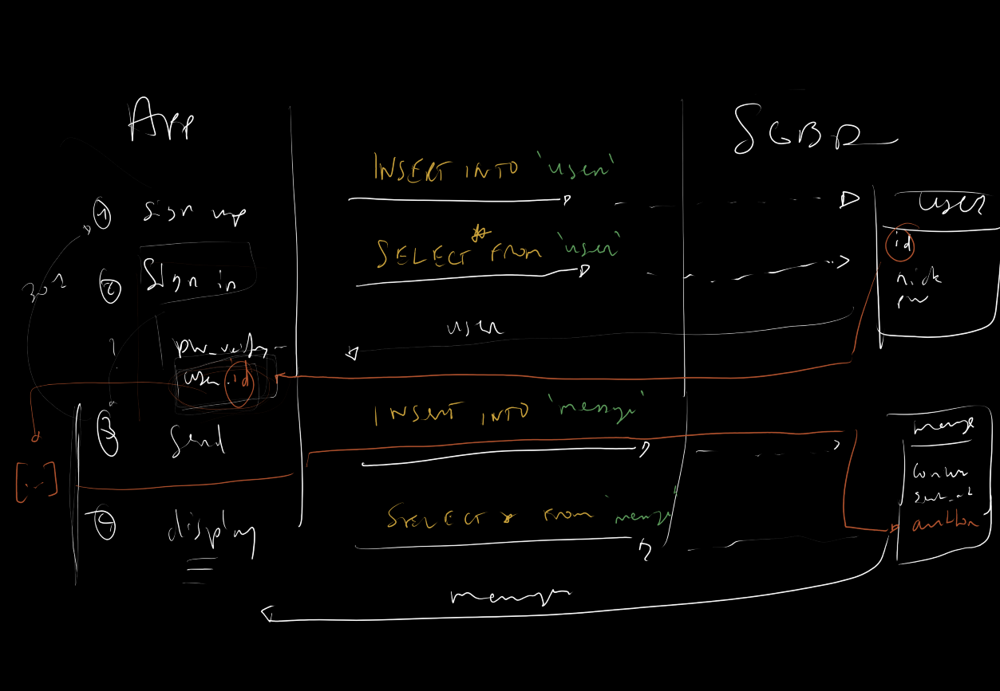

# Matinée du 17 décembre 2020

## L'application _message board_

On a eu l'occasion de re-discuter de l'application d'envoi de messages, et plus particulièrement de ce qu'il fallait ajouter pour gérer l'inscription et la connexion des utilisateurs. Le résultat de cette discussion peut être observé via cet affreux schema :

Celui ci est censé représenter les étapes que traverse notre utilisateur pour utiliser les fonctionnalités.

1. Inscription (_sign up_) qui insère une ligne dans la table `user`
2. Connexion (_sign in_) qui cherche une ligne dans la table `user` et effectue les vérifications de mot de passe, et stocke l'information du `user` quelque part.
3. Envoi de message/Affichage des messages, insertion et lecture des données dans notre table `message`, avec pour `author` notre `user.id` de l'utilisateur connecté.

A partir de là la tâche nous incombait d'implémenter ce comportement, et nous verrons cette implémentation demain.

## Les transactions SQL

Nous avons également énoncé l'existence en SQL du principe de _transaction_.

Une transaction en SQL est un moyen de cantonner des requêtes à un même _traitement_ qui peut ensuite être validé (`COMMIT`) ou annulé (`ROLLBACK`). De cette façon, toutes les requêts de notre transaction sont reconnues comme un même traitement et son _atomicité_ (indivisibilité) est garantie.

Cela vient en opposition au mode de fonctionnement par défaut de SQL qui est d'`autocommit` toutes les requêtes, c'est à dire que chaque requête est indépendante et son effet est appliqué immédiatement.

Les transactions sont donc une bonne façon d'effectuer des tests, car le fait de pouvoir utiliser `ROLLBACK` et même des _points de sauvegarde_ permet de revenir en arrière en cas d'erreur.

Un autre avantage, dû à l'_atomicité_ des transactions, est de pouvoir être sûr qu'un enchaînement de requête se passe sans qu'une requête _extérieure_ vienne foutre en l'air notre traitement, en modifiant une donnée ou autre.

Caractéristique supplémentaire des transactions, la _cohérence_. En effet, au moment où l'on commence une transaction, l'environnement est enregistré et validé (l'environnement comptant entre autres les contraintes d'unicité ou de clé étrangère...), ce qui vous permet d'avoir une meilleure confiance en la cohérence d'exécution de vos requêtes.

Cependant les transactions ne sont pas une _balle en argent_ permettant d'appliquer les règles `A.C.I.D.` (**A**tomicité, **C**ohérence, **I**solation, **D**urabilité) régissant nos SGBD.

En effet même si une transaction aide à ne pas avoir une influence externe lors de l'exécution de nos requêtes, il se peut que plusieurs transactions s'exécutent en même temps, et là de solutions plus sophistiquées pourraient être à appliquer (comme les _verrous_ par exemple). Mais ce sera pour une autre fois.

#### Commencer une transaction

Pour lancer une transaction on peut utiliser la commande `START TRANSACTION;`, qui sort SQL de son mode `autocommit` et nous permet d'effectuer nos requêtes dans un _environnement isolé_, dont les changements ne seront appliqués qu'au moment de `COMMIT`.

Après ça, on peut taper nos requêtes comme il nous chante, mais il faudra _valider_ cette transaction pour appliquer les changements induits.

#### Terminer une transaction

Fermer notre transaction et en appliquer les changements se fait via la commande `COMMIT;`. A ce moment là, toutes les requêtes seront executées les unes après les autres et il n'y aura plus de retour en arrière.

#### Revenir en arrière ?

Pendant une transaction (c'est à dire _avant_ d'utiliser `COMMIT`) il est possible d'annuler toutes les commandes executées à l'aide de `ROLLBACK`. Cette commande permet de rétablir notre environnement comme si on venait d'appeler `START TRANSACTION`.

Il est également possible d'utiliser des _points de sauvegarde_ à l'aide de `SAVEPOINT nom_du_savepoint;`, et d'y retourner avec `ROLLBACK TO nom_du_savepoint;`

On peut retirer un `savepoint` avec la commande `RELEASE SAVEPOINT nom_du_savepoint;`.

Ces commandes sont parfaites pour pouvoir tester, et ce avec un risque amoindri, nos requêtes SQL.

**Attention** : il n'est **pas possible** de `ROLLBACK` certaines opérations, comme par exemple `DROP` ou `TRUNCATE`. Ces opérations effectuées au niveau du moteur suppriment **complètement** les données associées de la base de données du moteur, et ne sont donc plus récupérables après l'exécution.

Pour récupérer une table ou base de données perdue à cause d'un `DROP`, seules des sauvegardes sont efficaces.

`DELETE` est _rollback-able_ cependant, sans souci.

#### Transactions avec PDO

PDO peut également gérer les transactions directement en utilisant des méthodes comme `PDO::beginTransaction` et `PDO::commit`/`PDO::rollback`.

Voir la [documentation de PDO](https://www.php.net/manual/fr/pdo.begintransaction.php) pour plus d'informations.
